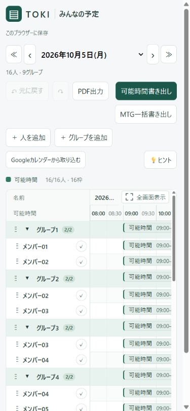
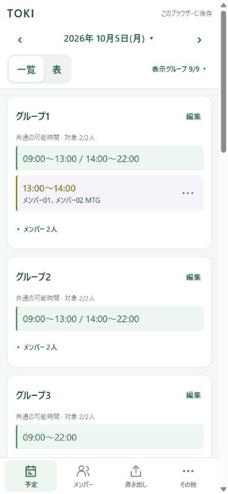
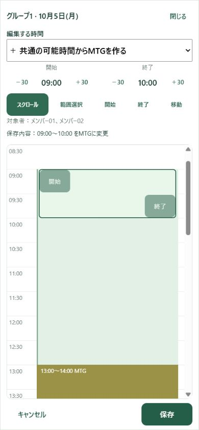

# TOKI スマートフォン向けUI設計書

作成日：2026年10月4日

対象コード：`e56c63a`

対象：iPhoneなどの小さい縦長画面、Safari、ホーム画面に追加したPWA
状態：全設計の承認後、実装へ移行。実装時の調整・検証結果は14章に記載。

## 1. 設計方針

**PC版の外観と操作を維持し、スマートフォンには「日別一覧を主画面とし、必要に応じて表へ切り替えるUI」を設ける。予定データと判定・保存処理は共通化する。**

### 確定事項と提案の区別

|区分|内容|
|---|---|
|ユーザー確認済み|PC版を変更しない。スマホは日別一覧を主画面にし、表へ切り替えられるようにする。スマホだけタップ式の時間調整・削除を追加する|
|既存仕様を維持|可能時間・MTGの計算、メンバー同期、共有、Google取込、書き出し、オフライン閲覧|
|本書の設計提案|画面配置、表示切替の境界、余白、操作領域、編集画面、メニュー構成|
|ユーザーからの追加要望|大きく多いボタンを整理。名前列による圧迫と、スクロール・予定挿入の競合を解消。プルダウンのチェックで不要なグループを非表示にする|
|ユーザー承認済み|グループ非表示はスマホ・この端末のみ。計算・書き出しに影響させない。詳細は7章|
|実機での確認が必要|使用したiPhoneの機種・iOS・Safari／PWAの別|

本書の寸法・操作案はTOKI向けの提案値。参照アプリの仕様やアクセシビリティ基準そのものと混同しない。

### 優先順位

1. 予定を見るための領域を確保し、名前と時間を読めること。
2. スクロールで予定を誤変更しないこと。
3. 指で操作でき、変更対象者・変更結果が分かること。
4. PC版とのデータ・機能の一貫性。

## 2. 現状の調査結果

### 確認方法

- 現行HTML・CSS・JavaScriptを確認。
- 実データを使わず、架空の16人・9グループをローカル表示。
- ブラウザー表示枠を390×844、375×667に変更して確認。スクロールバーを除く文書幅はそれぞれ375px、360px。
- これはデスクトップブラウザーでの狭幅確認であり、iPhoneのSafari・タッチ操作・ソフトウェアキーボードの実機検証ではない。

### ユーザーから報告された問題

1. ボタンが大きく、数も多い。
2. 固定のグループ名・人名列が表の大半を占め、予定を入れにくい。
3. 移動・スクロールしたいだけで予定が入る。
4. 予定を入れたいときは、画面が固まる、またはスクロールしてしまう。
5. 関係のないグループを選んで非表示にしたい。

「ボタンが大きい」への対応は、文字や押せる領域を一律に小さくすることではない。常設するボタン数・枠線・塗り面積を減らし、タップ領域は確保する。3・4の発生はユーザーの実機報告であり、以下のコード調査だけで原因を確定したものではない。

|確認できた事実|スマホでの問題・設計上の判断|
|---|---|
|表の最小幅1,260px。名前列172px、時間は32枠×34px|名前列が幅を占め、初期表示では08:00〜10:00付近しか見えない。日別一覧を入口にする|
|表の開始位置が画面上端から約388px|操作ボタンの折り返しが予定の表示領域を圧迫。書き出し・管理などは専用画面へ整理|
|検証条件では時間帯の高さ20px。端の操作領域は幅9px|指で端を選ぶ操作が難しい。専用編集画面と大きい操作領域が必要|
|一時除外ボタン22×22px、全画面ボタンの高さ26px|隣接操作を押し間違えやすい。モバイル側で領域を拡大|
|日付ラベルの幅が約58px|日付が省略される。画面上部で完全な日付を読める構成へ|
|帯は`touch-action:none`、空き領域は`pan-y`。5px移動でドラッグ開始、長押しは600ms|スクロールと編集が競合する可能性。誤変更の発生頻度は実機で未確認|
|`styles.css`に幅700px以下の指定と同じセレクターへの上書きが分散|さらに上書きを重ねず、モバイルの適用範囲を分離する|

現状の狭幅表示。架空データを使用。



根拠となる実装：[styles.css](../styles.css)、[app.js](../app.js)、[meeting-menu.js](../meeting-menu.js)、[index.html](../index.html)。

## 3. 参考にする著名アプリと採用する考え方

2026年10月4日に公式資料を確認。以下は各サービスのモバイルアプリに関する資料を含む。**ネイティブアプリとWebアプリの実装を同一視せず、画面構成・操作の考え方を参考にする。**

|参考|公式資料で確認した内容|TOKIへの適用案|
|---|---|---|
|Googleカレンダー|iPhoneでは日付への移動と、日別の予定一覧などへの表示切替を提供|選択日を中心に、一覧と表を切り替える。月名から日付選択へ進める。[公式資料](https://support.google.com/calendar/answer/6110849?co=GENIE.Platform%3DiOS&hl=en)|
|Notion|モバイルは複数列を1列にし、ホバーの代わりに`•••`や`+`を表示|内容を1列に整理し、追加・メニューを常時見つけられるようにする。[公式資料](https://www.notion.com/help/notion-for-mobile)|
|Slack|モバイルでは画面下の主要画面への入口と、画面上のフィルターを使い分ける|画面下で「予定・メンバー・書き出し・その他」を切り替え、対象の絞り込みは予定画面内に置く。[公式資料](https://slack.com/help/articles/46751260742035-Introducing-the-new-Activity-view-in-Slack)|

採用するのは情報の優先順位・1列化・明示的な操作入口。TOKIの緑、可能時間とMTGの色分け、用語は維持する。装飾目的の強い透過・ぼかし、アイコンだけの操作、長押しだけで見つかる必須機能は採用しない。

## 4. PC版とモバイル版の分離

### 4.1 外観・操作・データの境界

|対象|扱い|
|---|---|
|PCのガント表、上部ボタン、ダイアログ、色、寸法、余白|現行を維持。モバイル対応を理由に配置を変更しない|
|PCのクリック・ドラッグ・長押し・ショートカット|現行を維持|
|スマホの主画面・ナビゲーション・編集レイアウト|専用UI|
|日付計算、可能時間の集合演算、MTGの登録・解除・調整|共通の既存処理|
|入力検証、共有保存、競合検出、元に戻す・やり直す|共通の処理と単一の状態管理|
|人・グループの編集フォーム、書き出し、Google取込|内容と処理は共通。スマホでは1列・大きい操作領域に変更|
|PDF|現行の印刷専用レイアウトを共通使用。スマホ画面をそのまま印刷しない|
|一時除外・折りたたみ・画面選択|端末内。共有予定データには入れない|
|グループの表示チェック|一時除外と別の状態。端末内のスマホ表示だけに使用|

### 4.2 自動切替の提案

「縦長か横長か」だけで判定しない。ソフトウェアキーボードが出ると表示領域の縦横比が変わるため、入力中のUI切替を防ぐ必要がある。[MDNの説明](https://developer.mozilla.org/en-US/docs/Web/CSS/Reference/At-rules/@media/orientation)

|条件。幅はCSS px|初期UI|
|---|---|
|幅767px以下|モバイルUI|
|幅768〜1,023pxかつ主なポインターが`coarse`|モバイルUI。スマホ横向き・小さいタブレットも対象|
|それ以外|現行PC UI|

`pointer:coarse`は端末名ではなく主な入力装置の精度を表す。User-AgentによるiPhone決め打ちは行わない。[MDNの説明](https://developer.mozilla.org/en-US/docs/Web/CSS/Reference/At-rules/@media/pointer)

この境界は提案値。通常の横長PC画面は現状維持し、幅767px以下に縮めたPCウィンドウはモバイル表示になる。モバイルUI内の「表」はタッチ向けの比較表示であり、PC画面をそのまま縮小するものではない。

- 縦横回転でも選択日・対象者・一覧／表・スクロール位置を保持する。
- 編集・ダイアログ表示中はUIの切替を保留。閉じてから切り替える。
- 回転や`pointercancel`で中断されたドラッグは保存せず、直前の保存状態を維持する。
- キーボードの出入りだけでPC UIに切り替えない。

## 5. モバイルの画面構成

### 5.1 全体構成

```text
予定
 ├ 日付・週の選択
 ├ 日別一覧〔初期表示〕／比較表
 ├ 表示グループのチェック・人の検索
 └ 対象を選んで編集
     ├ 個人の可能時間
     ├ グループの共通時間からMTGを作成
     └ 登録済みMTGの調整・解除

メンバー
 ├ 人／グループの追加・編集・削除
 └ 所属の変更・並べ替え

書き出し
 ├ 可能時間書き出し
 ├ MTG一括書き出し
 └ PDF出力

その他
 ├ Googleカレンダー取込
 ├ 共有URLをコピー
 ├ 元に戻す／やり直す
 ├ 💡ヒント
 └ PWAの更新・インストール案内
```

下部ナビゲーションは4項目、ラベル付き。削除・保存などの実行ボタンはナビゲーションと混在させない。書き出し画面では「可能時間書き出し」と「MTG一括書き出し」を隣接させる。

### 5.2 日別一覧の画面案

以下の名前・時間は説明用の架空データ。

```text
┌────────────────────────────┐
│ TOKI                 同期済み │
│ ‹    2026年10月5日(月) ▾    › │
│ [一覧][表]  [表示グループ3/9▾]│
│                            │
│ グループ1   対象2/3人 [編集] │
│ 共通時間 09:00〜12:00        │
│          15:00〜22:00        │
│ MTG 13:00〜14:00 対象2人  … │
│ ▸ メンバーを見る            │
│                            │
│ グループ2   対象2/2人 [編集] │
│ 共通時間 なし                │
│                            │
│ …縦にスクロール…            │
├────────────────────────────┤
│ 予定  メンバー 書き出し その他│
└────────────────────────────┘
```

- 初回は全グループと未所属を表示する案。グループは予定表と同じ順に並べる。共通の可能時間、登録済みMTG、対象人数を1つのまとまりにする。
- 「表示グループ3/9」のように、表示中のグループ数を常時表示。全選択に戻す操作も選択パネル内に用意する。
- 名前で素早く探す入口は表示パネル内にまとめる。人を検索した結果では同じ人を重複表示せず、所属も添える。検索結果は表示グループとは別の一時表示であることを明示する。
- グループ内メンバーは「メンバーを見る」で展開。除外中の人も残し、名前に取り消し線と「対象外」を表示する。
- 可能時間がない人も省略せず「可能時間なし」。検索結果0件・データ未取得・オフライン未保存とは別表示にする。
- 名前と時間は原則省略しない。長い名前や時間の多い日はカードを縦に伸ばす。
- 可能時間の文字列は閲覧用。既存の帯と同様、通常タップだけで予定を変更しない。
- 編集は各カードの「編集」から開始。グループではその先に「MTGを設定」を表示。MTGの各行には対象者確認・操作用の`…`を設ける。
- グループの配下だけでなく、未所属の人も最後のまとまりに表示する。表示設定の詳細は7章。

### 5.3 日付操作

- 常設するのは選択日と前日・翌日の操作。日付をタップすると日付選択パネルが開く。
- パネル内は日曜〜土曜の7日間。前週・次週、月単位の日付選択、「今日」をここに集約する。選択日と今日は異なる表示で区別する。
- 320px幅でも日付の操作領域を縮めない。パネルの左右余白を6pxにした7×44pxの日付行を使用できる。文字拡大で収まらなければ日付列だけ横スクロールにする。
- 週・対象の変更時もグループの並び順、一時除外、MTG対象者は変更しない。
- 初期表示日は現行の保存済み選択日を引き継ぐ。UI変更だけで今日へリセットしない。

### 5.4 比較表

- 人名を左、日付と30分目盛りを上に固定する構造を維持。
- スマホ専用の表として、名前列は112〜136px、行高は最低48px。長い名前は折り返す。
- 時間軸の最小単位は30分、1枠44px以上を目安とする。16時間を画面幅に圧縮しない。
- 横スクロールは表の内部だけに限定。名前と時間見出しは固定し、時間帯の連続性を保つ。
- 表は比較・選択用。指のスワイプはスクロールを優先し、帯のドラッグで直接保存しない。「編集」から専用画面へ進む。
- 右上に「全画面表示」、表示中は「全画面終了」。アイコンと文字を併用し、操作領域を44px以上にする。
- 全画面は既存の画面内拡大方式を使用。SafariのブラウザーUIが必ず消えることは前提にしない。
- 一覧と表で選択日・対象・除外条件を共有。戻った際の位置も保持する。

## 6. 時間編集とタッチ操作

### 6.1 スクロールと編集を分ける

**通常の閲覧画面ではスワイプをスクロールに使い、変更は対象を明示してから行う。**

1. 一覧または表から「編集」を押す。
2. 個人名、またはグループ名・対象人数・日付を固定見出しに表示。
3. 1人または1グループの縦方向の時間軸を表示。08:00〜24:00、30分目盛りを維持。
4. 変更前と変更後をプレビュー。
5. 「保存」で一度だけ共通処理を実行。「キャンセル」では何も保存しない。

明示的な保存はモバイル向けの提案。PCのドラッグ終了時の保存は変更しない。未保存の変更がある状態で閉じる場合だけ、破棄するか確認する。

### 6.2 編集画面案

```text
┌────────────────────────────┐
│ キャンセル   メンバーA   保存 │
│ 10月5日(月)                 │
│ [追加] [時間調整] [移動]      │
│                            │
│ 09:00 ┃ 可能時間            │
│ 09:30 ┃                    │
│ 10:00 ┃ 〔選択中の範囲〕     │
│ 10:30 ┃                    │
│ …                          │
├────────────────────────────┤
│ 変更後 09:00〜11:00         │
│ 開始  [−30分] [+30分]       │
│ 終了  [−30分] [+30分]       │
│ [削除]                     │
└────────────────────────────┘
```

下部のタップ式調整・削除はユーザー確認済み。タイトル・詳細の入力欄は復活させない。数値入力フォームを予定の通常タップで開く方式にも戻さない。追加・時間調整・移動は選択対象に応じて切り替え、無関係なボタンを同時に並べない。

### 6.3 ドラッグの規則

|操作|スマホ案|
|---|---|
|新規の範囲指定|「追加」または「MTGを設定」を明示選択後、範囲をドラッグ。指から離れた固定位置に時刻を表示|
|30分追加|個人の追加モードで空き枠をタップすると、30分の追加をプレビュー|
|開始・終了の変更|選択中の帯に大きい操作つまみ。開始は左側、終了は右側に置き、狭い帯でも操作領域を重ねない|
|同じ長さで移動|選択中の帯の専用「移動」領域をドラッグ。通常の帯本体はスクロールを妨げない|
|長さゼロ|個人なら削除、グループの共通時間なら全区間をMTG化、MTGなら解除・復元をプレビュー|
|長押し|補助操作として維持。短い操作メニューを画面下に表示。同じ機能へ`…`からも到達可能|
|キャンセル|画面回転、複数指、`pointercancel`、アプリ切替などで中断した未確定ドラッグを破棄|

- 30分の縦幅は48pxを初期値とし、操作対象は最低44×44px。短い既存区間は実際の比率のまま描き、別の時間一覧からも選択できるようにする。
- 始点・終点・移動用の操作領域を重ねない。隣の予定の領域まで透明なタッチ領域を広げない。
- `touch-action:none`は明示的な編集操作の領域に限定。通常画面・ダイアログ全体でスクロールやピンチ拡大を禁止しない。
- ブラウザーとのジェスチャー競合を避けるため、操作開始前にモードと`touch-action`を決める。指を置いた後に切り替える前提にしない。
- 長押し時間・移動許容値は現行600ms・5pxを基準に実機評価する。根拠なく端末ごとの値を増やさない。

### 6.4 ドラッグを使わない補助操作

スマホに追加する方針をユーザー確認済み。具体的な操作案：

- 開始・終了をそれぞれ30分ずつ前後させる。
- MTGの移動は「30分前へ」「30分後へ」。時間の長さを維持する。
- 範囲の追加は、開始位置と終了位置を順番にタップして指定する。
- 個人の可能時間には「削除」。グループMTGには全員の解除、個人MTGにはその人だけの解除を提供する。
- 並べ替えには「上へ／下へ」、所属にはチェックボックスを用意する。

WCAG 2.2のドラッグ操作に関する基準は、例外を除きドラッグを使わない単一ポインター操作も求める。キーボード対応だけでは代替にならないため、この補助操作でも同じ結果を得られることを検証する。[W3Cの説明](https://www.w3.org/WAI/WCAG22/Understanding/dragging-movements)

### 6.5 維持する予定の規則

|対象|必須の動作|
|---|---|
|個人の可能時間|追加・移動・伸縮・削除。参加中のMTGと重なる部分は可能時間にしない|
|別の人への可能時間の移動|個人の編集メニューから移動先の人を選び、元の人・移動先・時間を確認して保存。通常のスクロールで別人へ移らない|
|グループの可能時間|現在の一時除外を除くメンバー全員の共通時間。単独の予定として保存しない|
|新しいグループMTG|共通の可能時間内だけ登録。30分タップや範囲指定が外にはみ出す場合は「⚠️可能時間がありません」。対象者をプレビューに列挙|
|グループの共通時間の短縮|減った部分をMTGにする。可能時間を自由に追加・移動する機能には変えない|
|既存MTGの拡張・移動|登録済み対象者全員の可能時間＋元のMTG時間で判定。現在の所属・一時除外が変わっていても対象者は維持|
|移動先が不適切|1人でも参加できない、または別MTGと競合する場合は変更しない。警告と元の時間を表示|
|MTGの短縮・解除|解放した区間を対象者の可能時間へ復元。別のMTGは維持|
|個人MTGの削除|その人だけ解除。グループの対象者表示にも反映|
|グループMTGの対象者の✖|選んだ人だけ解除・復元。対象者全員を外すとMTG自体を除去|
|グループの削除|そのグループのMTGを解除し、残る人の可能時間を復元|
|人の削除|その人だけMTGから除去|
|精密な既存時刻|12:50などを表示・保存時に丸めない。移動は元の長さを維持。新規入力は現行の30分単位|

30分未満の区間がある場合でも、UIの大きさを理由に開始・終了を丸めない。補助の±30分も共通検証を通し、範囲外や逆転は保存できない。

## 7. グループ・メンバーの操作

### 表示するグループを選ぶプルダウン

追加要望と以下の適用範囲は承認済み。

```text
表示グループ 3/9 ▾
┌────────────────────────────┐
│ 表示するグループ       閉じる │
│ [−] すべて選択              │
│ [✓] グループ1               │
│ [✓] グループ2               │
│ [ ] グループ3               │
│ …                          │
│ [✓] 未所属の人              │
│ この端末の表示だけに適用      │
│ キャンセル            適用  │
└────────────────────────────┘
```

- スマホだけに追加し、PCのボタン・配置は変更しない。
- チェックを外すと、そのグループと配下の人をまとめて非表示。複数所属の人は別の表示中グループには残る。
- グループを隠しても、人が「未所属」へ移ったとは扱わない。「未所属の人」は実際にどのグループにも所属していない人。
- チェックはラベル行全体で操作。少数なら展開式、多数・小さい画面では同じチェック一覧を下部シートに表示し、ネイティブの単一選択`select`は使用しない。
- 一部だけ選択したときの「すべて選択」は中間状態。全選択済みと区別する。
- 選択中は下書きとし、「適用」で表示に反映。これにより、チェックの途中で背景が動いて押す位置が変わらない。
- 一覧と比較表で同じ選択を使用。並び順は変更しない。表示設定は端末内保存とし、別端末・他人の画面には影響させない。
- 非表示のグループを保存する方式にし、後から追加された新しいグループは初期状態で表示する。
- 全て非表示の場合は「表示するグループがありません」と「表示グループを選ぶ」。データが消えたように見せない。
- 可能時間の計算、MTGの対象者、所属、一時除外、書き出しの全選択初期値は変更しない。書き出し画面では「表示設定とは別に選択」と説明する。

|機能|見え方|計算・予定への影響|
|---|---|---|
|グループ非表示|グループと配下の行を隠す|なし|
|グループ折りたたみ|グループを残し、配下を畳む|なし|
|一時除外|人を残し、名前を取り消し線にする|共通時間と新規MTGの対象が変わる。既存MTGは維持|
|所属から外す|そのグループから人を外す|共有の所属が変わる。登録済みMTGは維持|

### グループの予定カード

- 「対象2/3人」「共通の可能時間」「MTG」を区別する。
- 対象メンバーの変更は「対象者」から開く。名前の取り消し線＋「対象外」で示し、一覧から消さない。
- 一時除外には「この端末のみ」を明記。共有の所属変更と別の画面・文言にする。
- 全員を除外した場合は「対象者がいません」。共通時間なしと混同しない。
- 作成済みMTGには実際に登録された対象者を表示。現在の除外設定から再計算しない。

### メンバー管理画面

- 上部に「人を追加」「グループを追加」。人一覧の末尾にも「人を追加」を常時表示する。
- 同名追加は警告し、別の名前を入力するよう誘導する。
- 所属は複数選択。一時除外と同じチェックボックス画面を流用しない。
- 「並べ替え」モードでのみドラッグ用つまみを表示。通常の縦スクロールで並び替わらないようにする。
- グループから外す操作にはグループ名を明記。「このグループから外す」はその所属だけを解除し、他の所属・登録済みMTGは維持。
- 人・グループの削除は既存と同様に対象と影響を表示して確認。予定の通常編集すべてに確認画面を追加することはしない。

## 8. 共通フォーム・書き出し・その他

### ダイアログの使い分け

|内容|スマホでの表示|
|---|---|
|削除・時間コピーなど短いメニュー|画面下から開く操作シート。1項目の高さ48px以上|
|人・グループ編集、対象者一覧|幅いっぱいのシート。長い場合は本文のみ縦スクロール|
|時間編集、Google取込、書き出し|画面全体を使うパネル。見出しと主要ボタンを固定し、本文をスクロール|

- 同時に開くパネルは1つ。背景を操作不可にし、閉じたら元のボタンにフォーカスを戻す。
- 閉じる操作は必ず文字か読み上げ名を付ける。ドラッグで閉じる操作だけに依存しない。
- 全画面パネル内では下部ナビゲーションを操作対象から外し、パネルの保存・コピー操作と重ねない。
- キーボード表示中も入力欄・エラー・保存ボタンに到達できるようにする。
- パネルを移動するときに共有URLの`#share`を上書きしない。画面遷移はハッシュから独立させる。

### 書き出し

- 開始日・終了日・対象の順序は統一し、スマホでは1列表示。
- MTGのグループ選択は、チェックボックスだけでなくラベル行全体をタップ可能にする。
- 全選択の初期値、期間上限366日、可能時間がない日の「なし」、MTGがない日の省略は維持。
- MTG出力は予定表のグループ順。同じ対象者・同じ日の時間を1行にまとめ、別グループとの間だけ1行空ける。
- コピー文字列を作る処理はPCと共通。表示欄だけ折り返し可能にして、実際の改行文字は変更しない。
- 「コピー」は画面下の押しやすい位置。成功を表示し、失敗時は手動選択・コピーに進める。
- PDFは既存の1日／1週間の印刷データを利用。iPhoneでの保存手順は実機で確認してヒントへ掲載する。

### Google取込・共有・PWA

- Googleログインは任意。予定表を使うためのログインは追加しない。
- メインカレンダーのFreeBusyのみを取得。期間と置換内容を確認して反映する既存フローを維持。
- 11:10〜11:50に予定があれば11:00〜12:00を可能時間にしない。MTGも維持する。
- 共有URLのコピー、PWA更新・インストール案内は「その他」にまとめる。
- Google OAuth、コピー、印刷、インストールはSafariとPWAで個別に実機確認する。同じ挙動になると断定しない。

## 9. 寸法・見た目・アクセシビリティ

以下はモバイルUIだけに適用する提案値。PCの寸法を変更しない。

|項目|提案値・規則|
|---|---|
|通常の操作領域|最低44×44 CSS px、主要ボタンは高さ48px|
|ボタンの密度|主画面に追加・書き出し・Google取込を並べない。副操作は枠なしのラベル付きボタンにし、44pxの操作領域内で見た目を軽くする|
|隣接操作の余白|原則8px。日付列などでは4px。削除と保存は隣接させない|
|本文・入力欄|16pxを基準、行間1.5。補助文字は原則13px以上|
|見出し|18〜20px。太さと余白で区切り、全てをカード・枠で囲わない|
|左右余白|通常16px、小さい画面12px。安全領域が大きい場合はそちらを優先|
|角丸|操作ボタン8px、まとまり12px、シート上端16pxを目安|
|色|既存の濃緑`#1c574b`を基調。可能時間は緑、MTGは既存のグループ色と文字ラベル|
|下部ナビゲーション|高さ56px＋安全領域。本文の下余白にも同じ分を確保|
|固定見出し|通常時は日付と表示切替を中心に構成。補助情報を重ねて多段固定しない|
|動き|短い遷移に限定。`prefers-reduced-motion`では省略。振動を操作完了の唯一の通知にしない|

AppleはネイティブUIの目安として44×44 **pt**、WCAG 2.2 AAは例外を伴う24×24 **CSS px**の最小対象サイズを示している。単位と適用範囲は異なる。TOKIでは押しやすさを重視し、Webの設計値として44×44 CSS pxを採用する案とする。[Apple](https://developer.apple.com/design/tips/)／[W3C](https://www.w3.org/WAI/WCAG22/Understanding/target-size-minimum)

- 通常の文字はコントラスト比4.5:1を検証。色分けだけに依存せず「可能時間」「MTG」「対象外」を併記。[W3C](https://www.w3.org/WAI/WCAG22/Understanding/contrast-minimum)
- 文字拡大・ピンチ拡大を禁止しない。320 CSS pxでも本文を読むための横スクロールを不要にする。比較表など2次元配置が必要な部分は別扱い。[W3C](https://www.w3.org/WAI/WCAG22/Understanding/reflow)
- VoiceOverで、名前・日付・時間・操作対象・除外状態を読み上げられること。取り消し線だけで状態を伝えない。
- ラベルは「削除」だけでなく、読み上げ名に対象を含める。例：`メンバーAの可能時間09:00〜10:00を削除`。

### iPhone固有の表示領域

- `viewport-fit=cover`を採用する場合は、`env(safe-area-inset-*)`を使いノッチやホームインジケーターとの重なりを防ぐ。余白は安全領域と通常余白の大きい方を使う。[WebKit](https://webkit.org/blog/7929/designing-websites-for-iphone-x/)
- 高さは`100dvh`を基本とし、古い環境向けのフォールバックを設ける。ブラウザーのツールバー伸縮に追従する目的で使う。[WebKit](https://webkit.org/blog/12445/new-webkit-features-in-safari-15-4/)
- `100dvh`だけでキーボードへの対応が完了すると見なさない。本文のスクロール、固定ボタン、入力フォーカスを実機で検証する。
- `calc(100dvh - 固定の大きな余白)`による帳尻合わせを重ねず、ヘッダー・本文・下部操作をGrid/Flexで分割する。

## 10. 保存状態・例外表示

|状態|表示と操作|
|---|---|
|初期取得中|「予定を読み込み中」。空の予定一覧に見せない|
|共有保存中|「保存中…」。連打を防ぎ、完了前に「保存済み」にしない|
|保存成功|「同期済み」。変更後に短い通知と「元に戻す」を表示|
|競合|「他の人が更新しました。最新の予定を確認してください」。古い下書きで上書きしない|
|オフライン|「オフライン・閲覧のみ」と最終取得時刻。編集を無効化し、閲覧・コピーは可能|
|この端末に保存がない|「接続後に予定を読み込めます」。全員が参加不可とは表示しない|
|可能時間なし|対象名と「可能時間なし」。グループなら対象人数と一時除外への入口を表示|
|エラー|対象・原因・やり直し方法をその場に表示。重要なエラーを短いトーストだけで消さない|

一時除外は端末ごとの表示・新規MTG対象選択の状態であり、他人の画面には同期しない。UI上の非表示・折りたたみはアクセス制限ではない。共有URLを知っている人が全員の予定を編集できる現在の範囲を維持し、新しい権限や外部送信先は追加しない。

## 11. 実装時の分離方法

現行は依存の少ないJavaScript構成。UI分離のためだけにフレームワークを全面導入しない。

```text
共有データ・通信：shared.js、既存の端末保存
              ↓ 単一のboard／revision／保存窓口
共通処理：model.js・availability.js・schedule.js
              ↓ 同じ計算結果とコマンド
     ┌────────┴─────────┐
PC表示                         モバイル表示
現行DOM・styles.css             mobile-ui.js・mobile.css
現行の操作                     一覧・比較表・タッチ編集
     └────────┬─────────┘
共通フォーム・書き出し・Google取込・印刷
```

### ファイルごとの責務案

|対象|方針|
|---|---|
|`index.html`|現行PC DOMを維持。モバイル用ルートを追加し、モバイルのIDは`mobile-`で区別。HTMLとCSSは別ファイル|
|`styles.css`|PCの既存ルールを凍結。モバイル開発を理由とする全体の書き換えを避ける|
|`mobile.css`〈新規案〉|`#mobile-app`配下と`html[data-ui="compact"]`時の共通ダイアログだけに適用。グローバルな`button`や`:root`の上書きをしない|
|`mobile-ui.js`〈新規案〉|一覧・比較表・編集画面の描画、フォーカス、タッチ操作。保存・集合演算は持たない|
|`ui-mode.js`〈新規案〉|表示モード判定と切替。CSSとJavaScriptの境界条件を一致させる|
|`app.js`|IIFE内部の状態と保存処理に共通の窓口を設ける。PCのイベント処理・描画結果を保ったまま、段階的に接続する|
|`schedule-controller.js`〈必要時の新規案〉|既存の`commit`、保存・競合・履歴・選択日を移す先。状態の二重管理を避けるための抽出であり、新しい保存方式を作らない|
|`model.js`・`availability.js`・`schedule.js`|PCとモバイルで同じ関数を呼ぶ。今回のUI分離によるスキーマ変更は不要|
|既存の書き出し・Google取込UI|まず処理とフォームを再利用し、共通ダイアログのモバイル時の配置を調整|
|`scripts/pwa-assets.cjs`|実装時に新規公開資産を追加。配信とオフラインキャッシュの対象を一致させる|

### 実装上の制約

- PC・モバイルを同時に操作可能にしない。非表示のルートはフォーカス・読み上げ・ポインター操作の対象外にする。
- 現行のPC側グローバルリスナーがモバイルの操作を拾わないよう、対象ルートとモードを確認する。
- PC用`.event`などをモバイルDOMへ不用意に流用しない。CSSとイベントの意図しない流入を防ぐ。
- 共有ダイアログは1組を再利用。名前やIDの重複、保存リクエストの二重送信を防ぐ。
- boardとrevisionは1つ。二重のポーリング、別のローカル保存キーによる予定の分岐を作らない。
- 下書きはメモリー内。保存直前に共通検証とrevisionを確認し、競合時は最新表示へ戻す。古い人のインデックスで別人を編集しない。
- 一覧／表／編集の切替で人・グループの所属やMTG対象者を書き換えない。
- 表示グループの状態は、一時除外用の保存キー・計算引数とは分離。共有予定ごとにローカル保存を分け、別の予定表の同じグループIDに誤適用しない。
- 新規UI資産はService Worker更新とセットで配信。旧HTMLと新JSだけが混在する状態を検証する。

## 12. 実装順序と受け入れ条件

### 実装順序

1. **基準保存**：同じ架空データでPCのスクリーンショット・操作結果を記録。
2. **表示の分離**：モバイルの一覧・日付・ナビゲーション・比較表を読み取りから実装。
3. **共通UIの適応**：書き出し、メンバー編集、Google取込、ヒントを1列に整理。
4. **編集の接続**：タッチ用の時間編集を共通の保存処理へ接続。
5. **実機検証**：SafariとPWA、縦横回転、キーボード、通信断を確認。
6. **PCとの差分確認**：外観・操作の退行がないことを確認して公開。

### 受け入れ条件

|分野|合格条件|
|---|---|
|PCの保全|1,280×800、1,440×900、1,920×1,080で既存画面と位置・色・寸法が同じ。フォント描画差等を除く意図しない視覚差分0。主要操作も同一|
|狭幅表示|320／360／375／390／430 CSS pxで、本文の横はみ出し・文字重なり・押せない操作がない|
|境界|767／768／1,023／1,024pxと`fine`／`coarse`で想定どおり切替。キーボードだけで表示モードが変わらない|
|予定の表示領域|標準文字サイズ・オンライン時に、日別一覧の最初の項目が上端から260px以内で始まる。拡大文字・警告表示時は可読性を優先|
|タッチ|必須ボタン44×44px以上。操作領域の重なりなし。通常の上下・左右スクロールでは保存処理を呼ばない|
|データ|同じ編集入力からPC・モバイルで同じboardになる。12:50などの時刻とMTGの実参加者を保持|
|グループ|一時除外、共通時間、全員除外、所属変更後の既存MTG、参加者の部分解除が仕様どおり|
|表示チェック|非表示は一覧と比較表へ反映。複数所属の別の行は残る。共通時間・MTG・書き出し対象・PCの外観は変わらない|
|MTG調整|元のMTG時間を含む可能範囲内だけ拡張・移動可能。不可能な範囲は警告して未保存|
|書き出し|PCとコピー文字列が完全一致。画面上の折り返しがコピー内容に混入しない|
|例外|保存失敗・競合・オフラインで成功表示しない。復帰後に最新データを確認してから編集可能|
|アクセシビリティ|VoiceOverで対象と状態を判別。文字200%でも主要操作に到達。フォーカスが固定UIに隠れない|
|実機|小型iPhoneと標準サイズiPhoneで、Safari／PWA、縦／横、キーボード、コピー、Google認可、印刷を確認|

狭幅ブラウザーのスクリーンショットだけで「iPhone対応完了」とは判定しない。検証時には実際の機種・iOS・ブラウザー版・表示形態を記録する。

## 13. 設計確定前の確認事項

1. グループ非表示をスマホだけ・この端末だけに適用し、グループ配下の人も隠すこと。計算・MTG・書き出しには影響させないこと。承認済み。
2. 実機評価に用いるiPhoneの機種と利用形態。未指定の場合は小型・標準サイズを対象にして検証する。

日別一覧を主画面にし、比較表へ切り替えること、スマホだけタップ式の補助編集を追加することは確認済み。寸法などの提案値は、上記の受け入れ条件で確認しながら調整する。

## 14. 実装記録

2026年10月4日。ユーザーが全案を承認し、検証中に判明した改善は推奨方針で調整することも承認。

### 実装構成

- `mobile-ui.js`：画面切替、日別一覧、比較表、表示グループ、メンバー管理、編集画面。モード判定もこのファイルへ集約。
- `mobile-model.js`：モバイルの編集内容を既存の `schedule.js` の操作へ渡す薄い窓口。独自の可能時間計算や保存は追加しない。
- `mobile.css`：専用ルートとモバイル時の共通ダイアログに限定したスタイル。
- `app.js`：既存の状態・保存・履歴・共有同期への窓口を追加。PCのガント描画・操作は維持。
- 公開用の資産一覧に上記3ファイルを追加。Service Workerは資産の内容ハッシュで更新。

### 実装時に調整した点

|項目|採用した動作・理由|
|---|---|
|一覧の初期表示|グループのメンバーは初期状態で折りたたみ。複数グループの共通時間・MTGを先に見渡せる。展開状態は端末内に保存|
|表示グループ|チェックは下書き。「適用」で反映。全選択・一部選択の中間表示に対応。設定キーは共有予定表ID／端末内モードで分離|
|並べ替え|スマホは「↑↓」によるタップ操作、所属変更はチェックボックスへ統一。メンバー管理中も縦スクロールで行を誤移動させない。PCのドラッグは維持|
|時刻調整|開始・終了の±30分、長さを保つ30分前後への移動を用意。縦タイムラインにはスクロール・範囲選択・開始・終了・移動モードを設け、1回のドラッグ終了後はスクロールに戻す|
|個人間の移動|既存可能時間を選び、「移動先の人」を選択。元の人→移動先と時間を保存前に表示。移動先のMTGは保持|
|長押しと見つけやすさ|個人の時間ラベルやMTGに長押しメニュー。同じ操作へ「⋯」から到達可能。通常の一覧・表上のスクロールは予定を変更しない|
|破棄の確認|ブラウザー標準の確認ダイアログを使わず、編集画面内の「編集に戻る／変更を破棄」で完結。未操作の初期値だけなら破棄確認しない|
|共通フォーム|人・グループ・Google取込・書き出しは既存フォームを再利用。入力は16px、スマホでは1列。長いフォームはシート内部をスクロール|
|競合|編集開始時の予定表を記録。別タブ・共有先の更新が届いた場合は保存を禁止し、閉じて最新表示から再編集。未確定操作は共有先へ送らない|
|予定のないグループ|共通時間なしと対象者0人を別の文言で表示|

### 検証の扱い

- 架空の予定表で検証し、共有中の実予定を試験用に書き換えない。
- 自動テスト：表示フィルターによる非変更、MTG対象者、範囲外拒否、解除・復元、精密な時刻、個人間移動。
- ローカルブラウザー：スクロールモードのポインター移動で未変更、編集モードのプレビュー、操作取消、別タブ更新時の保存禁止を確認。
- 実際のiPhone／Safari／ホーム画面PWA、VoiceOver、OSのキーボード・印刷・Google認可は、実機を操作できる環境での追加確認が必要。デスクトップの狭幅表示や合成ポインター試験と区別する。

### 検証結果（2026年10月4日）

|確認|結果|
|---|---|
|自動テスト|既存101件＋モバイルモデル9件＋モバイルUI13件、計123件成功。UIテストは実際のapp.jsと編集UIをJSDOMで起動し、共有保存部分のみ代替|
|PC外観|1,280×800／1,440×900／1,920×1,080で、変更前後のヘッダー、ツールバー、表、名前、時間帯、日付操作、フッターのDOM寸法・位置・色・フォントが一致。既存styles.cssの差分なし|
|PC操作|ヒントの開閉、週移動、全画面の開始・終了をブラウザーで確認|
|スマホ一覧|幅320／360／375／390／430pxで本文の横はみ出しなし。最初のカードは上から約164px。主要ボタンは44×44px以上|
|小型画面の編集|320×568で保存・キャンセルが画面内。編集ボタンの44×44pxを確保。時刻は固定の操作欄と軸に表示し、短い時間帯のハンドルと文字が重ならないよう整理|
|MTG|ローカルの架空予定で作成・拡張・移動を保存し、グループと実参加者の可能時間が同期することを確認|
|フィルターと書き出し|グループ非表示を適用しても他グループは表示。MTG書き出しは全グループ選択を維持。共有の書き出し関数とコピー文字列が一致する自動テストに成功|
|タッチ中断・競合|通常スクロール、長押し前の指移動、複数タッチ、回転、操作取消、別タブ・共有更新、保存失敗、オフラインを自動テスト。未確定の編集を保存しない|

ブラウザー確認はデスクトップChromiumの画面幅変更によるもの。iPhone実機での受け入れ確認は未実施。




